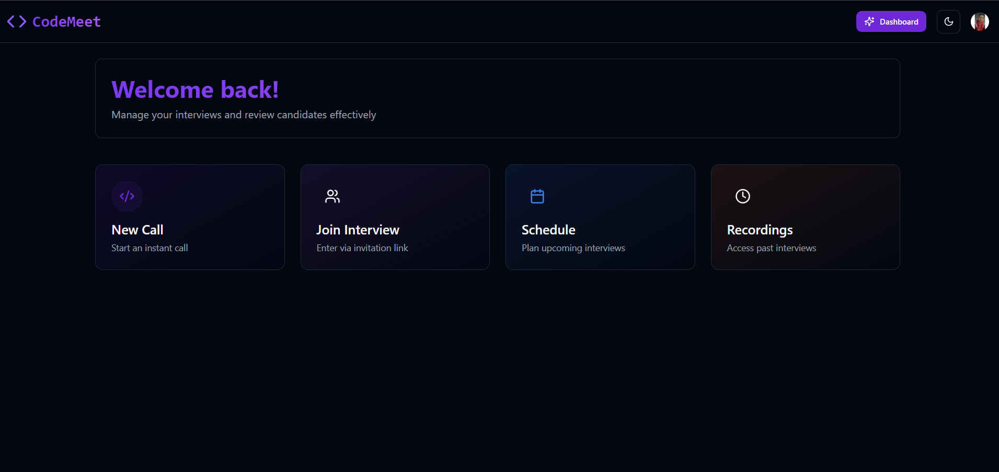
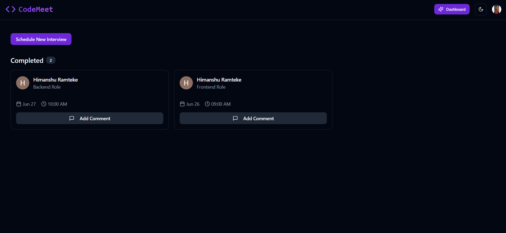
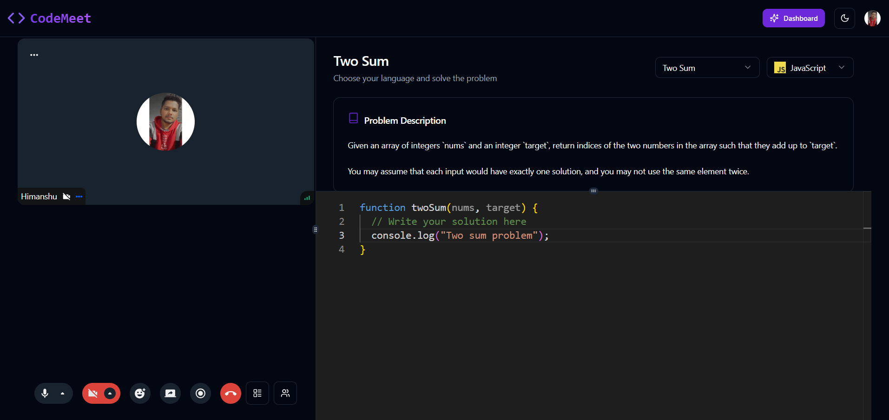
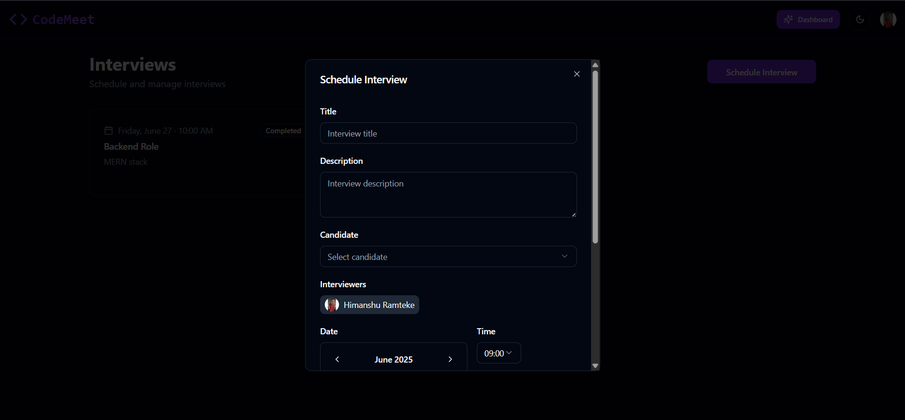
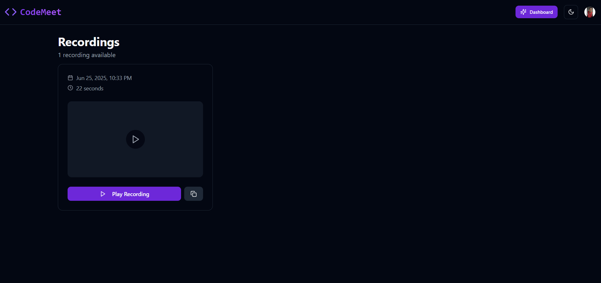
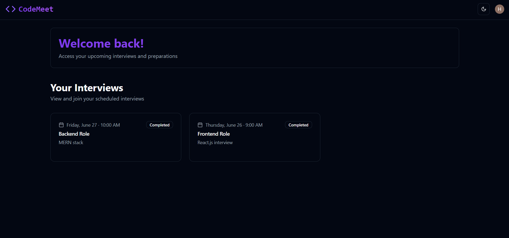

<h1 align="center">CodeMeet : A Video Calling Interview Platform</h1>

CodeMeet is a modern video calling interview platform designed to streamline the interview process. It provides a seamless experience for both interviewers and candidates, offering features like video calls, screen sharing, code editing, and role-based access control. This project aims to simplify technical interviews and enhance collaboration.

## 🚀 Key Features

- **Video Calls:** Real-time video communication for face-to-face interviews.
- **Screen Sharing:** Allows candidates to share their screens for code walkthroughs and presentations.
- **Screen Recording:** Enables recording of interview sessions for later review and analysis.
- **Authentication:** Secure user authentication using Clerk.
- **Role-Based Access Control:** Differentiates access for candidates and interviewers. Candidates can only join interviews, while interviewers can create and manage them.
- **Server Components & Actions:** Leverages Next.js server components and actions for enhanced performance and security.
- **Dynamic Routes:** Uses Next.js dynamic routes to handle meeting-specific URLs.
- **Styled with Tailwind CSS:** Utilizes Tailwind CSS for a modern and responsive user interface.
- **Code Editor Integration:** Monaco Editor integration for real-time collaborative coding.
- **Real-time Communication:** Stream integration for robust video and chat functionalities.
- **Customizable Themes:** Supports light and dark themes using Next Themes.
- **Interview Scheduling:** Allows interviewers to schedule interviews with specific candidates and time slots.
- **Coding Challenges:** Integrated coding challenges with starter code in multiple languages.











## Candidate View

Highlights:

- 🚀 Tech stack: Next.js & TypeScript, [Stream](https://getstream.io/), [Convex](https://docs.convex.dev/home), [Clerk](https://clerk.com/)
- 🎥 Video Calls
- 🖥️ Screen Sharing
- 🎬 Screen Recording
- 🔒 Authentication & Authorization
- 💻 Server Components, Layouts, Server Actions
- 🎭 Client & Server Components
- 🛣️ Dynamic & Static Routes
- 🎨 Styling with Tailwind & Shadcn
- ✨ Server Actions
- ✅ Candidates can only log in and join interviews.
- 🛠️ Interviewers can create, manage, and conduct interviews.

---

### Setup .env file

```js
NEXT_PUBLIC_CLERK_PUBLISHABLE_KEY=
CLERK_SECRET_KEY=
CONVEX_DEPLOYMENT=
NEXT_PUBLIC_CONVEX_URL=
NEXT_PUBLIC_STREAM_API_KEY=
STREAM_SECRET_KEY=
NEXT_PUBLIC_CLERK_FRONTEND_API_URL=
```

---

### Run the app

```shell
npm run dev
```
